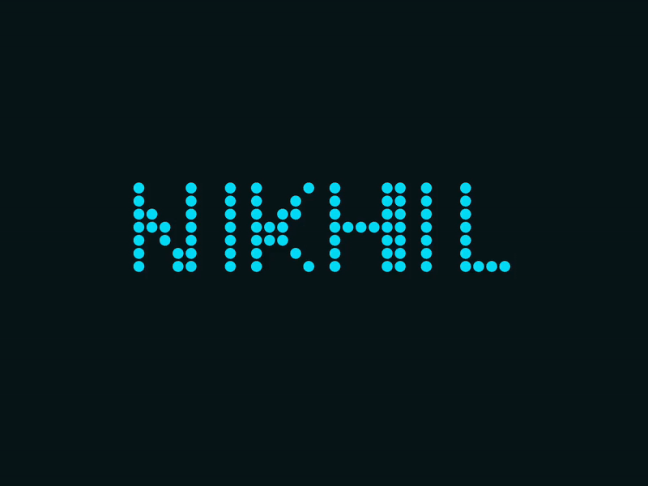
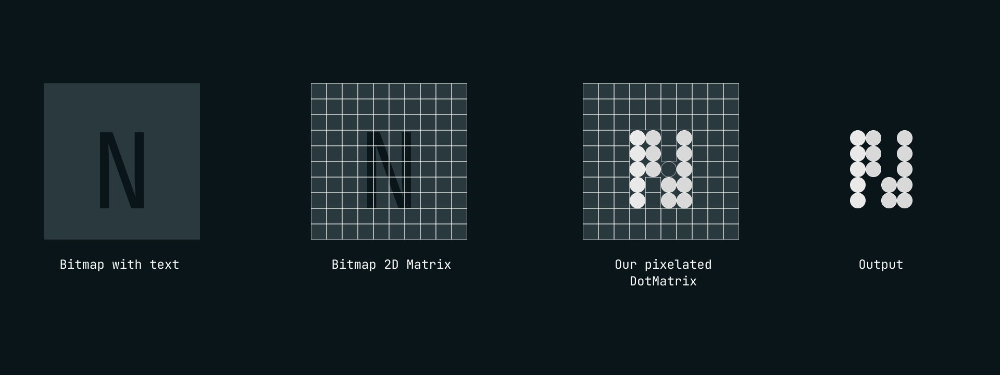

# Dotify 🎯
**Render Retro Style Text in Jetpack Compose using Bitmaps**

 

---

### 🧠 How It Works

1. **Create a Bitmap with Text**  
   We use `android.graphics.Canvas` to draw text on a mutable bitmap (since Compose doesn’t support direct bitmap text rendering).

2. **Scale the Bitmap**  
   The bitmap is resized based on the number of dots (rows × columns) we want. More dots = higher clarity.

3. **Convert to Dot Matrix**  
   Each pixel's alpha value is extracted and used to build a 2D matrix. If alpha > 0, we mark it for display.

4. **Display the Matrix**  
   Using basic Compose layouts, we render each cell as a colored circle if it's visible, or leave it empty if not.

---

### 🔗 Blog Post
👉 [Read the full blog post here](https://medium.com/@nikhil.here)
